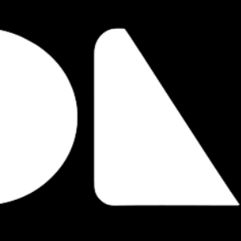

<p align="center">
  
</p>

# Armas

[](https://crates.io/crates/armas)
[](https://docs.rs/armas)
[](https://opensource.org/licenses/MIT)
[](https://github.com/PoHsuanLai/Armas/actions/workflows/ci.yml)
[](https://pohsuanlai.github.io/Armas/)

Live Demo: [https://pohsuanlai.github.io/Armas/](https://pohsuanlai.github.io/Armas/)

A theme-aware component library for [egui](https://github.com/emilk/egui), inspired by [shadcn/ui](https://ui.shadcn.com).

Armas provides styled, ready-to-use components so you can build polished egui interfaces without manually configuring drawing commands and style APIs.

## Usage

```rust
use armas::prelude::*;

// Initialize the theme
ctx.set_armas_theme(Theme::dark());

// Use components in your update loop
Button::new("Deploy Project")
    .variant(ButtonVariant::Default)
    .show(ui);
```

## Running the Showcase

```bash
# Native
cargo run -p armas-web

# Web (WASM) — requires trunk (cargo install trunk)
cd crates/armas-web && trunk serve
```

## Crates

| Crate | Description |
|-------|-------------|
| [`armas`](https://crates.io/crates/armas) | Umbrella crate with feature-gated re-exports |
| [`armas-basic`](https://crates.io/crates/armas-basic) | Core components and theme system |
| [`armas-audio`](https://crates.io/crates/armas-audio) | Audio/DAW-specific components |
| [`armas-icon`](https://crates.io/crates/armas-icon) | SVG icon system |

## Acknowledgements

Visual design and API patterns inspired by:

- [shadcn/ui](https://ui.shadcn.com/)
- [HeroUI](https://www.heroui.com/)
- [Aceternity UI](https://ui.aceternity.com/)

## License

Licensed under the [MIT license](LICENSE).
